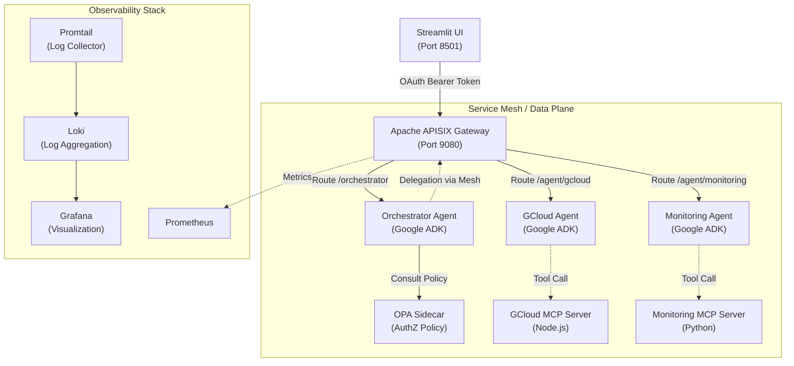

# FinOptiAgents Platform

The **FinOptiAgents Platform** is an enterprise-grade AI microservices architecture designed to automate Google Cloud operations. It leverages the **Google Agent Development Kit (ADK)** to build autonomous agents that interact through a **Service Mesh** secured by **Google OAuth** and analyzed via full-stack **Observability**.

---

## 🏗️ High-Level Architecture

The platform follows a strict **Microservices & Service Mesh** pattern where all traffic is mediated by **Apache APISIX**.



### Key Components

| Component | Technology | Responsibility |
|-----------|------------|----------------|
| **Service Mesh** | Apache APISIX | Centralized Routing, Rate Limiting, Observability Injection |
| **Orchestrator** | Google ADK (Python) | Intent Detection, Plan Generation, Agent Delegation |
| **Sub-Agents** | Google ADK (Python) | Domain-specific execution (GCloud resource mgmt, Monitoring) |
| **Mock Servers** | MCP Protocol | Standardized tool execution for GCloud and Monitoring tools |
| **Frontend** | Streamlit + OAuth | User Interface with Google Sign-In integration |
| **Security** | OPA (Rego) | Fine-grained Role-Based Access Control (RBAC) |
| **Config** | Secret Manager | Secure storage for API keys and Service Account credentials |

---

## � Docker Services & Images

| Service | Container Name | Image / Build Context | Internal Port | Protocol | Description |
|---------|----------------|-----------------------|---------------|----------|-------------|
| **APISIX** | `finopti-apisix` | `apache/apisix:3.7.0-debian` | 9080, 9180, 9091 | HTTP | API Gateway, Admin API, Prometheus Metrics |
| **Etcd** | `finopti-etcd` | `gcr.io/etcd-development/etcd:v3.5.0` | 2379 | HTTP/gRPC | Configuration storage for APISIX |
| **OPA** | `finopti-opa` | `openpolicyagent/opa:latest` | 8181 | HTTP | Authorization Policy Engine |
| **Orchestrator** | `finopti-orchestrator` | `build: orchestrator_adk/` | 5000 | HTTP | Main ADK Agent (Brain) |
| **GCloud Agent** | `finopti-gcloud-agent` | `build: sub_agents/gcloud_agent_adk/` | 5001 | HTTP | Wrapper for GCloud operations |
| **Monitoring Agent** | `finopti-monitoring-agent` | `build: sub_agents/monitoring_agent_adk/` | 5002 | HTTP | Wrapper for Observability tools |
| **GCloud MCP** | `finopti-gcloud-mcp` | `finopti-gcloud-mcp` | 6001 | JSON-RPC | MCP Server for gcloud CLI |
| **Monitoring MCP** | `finopti-monitoring-mcp` | `finopti-monitoring-mcp` | 6002 | JSON-RPC | MCP Server for logs/metrics |
| **Loki** | `finopti-loki` | `grafana/loki:2.9.3` | 3100 | HTTP | Log Aggregation System |
| **Promtail** | `finopti-promtail` | `grafana/promtail:3.0.0` | N/A | HTTP | Log Collector & Shipper |
| **Grafana** | `finopti-grafana` | `grafana/grafana:10.2.3` | 3000 | HTTP | Visualization Dashboard (UI on 3001) |
| **Streamlit UI** | `finopti-ui` | `build: ui/` | 8501 | HTTP | Frontend Application |
| **APISIX Init** | `finopti-apisix-init` | `curlimages/curl:latest` | N/A | - | Ephemeral initialization script |
| **APISIX Dashboard**| `finopti-apisix-dashboard`| `apache/apisix-dashboard:3.0.1-alpine`| 9000 | HTTP | Web UI for APISIX Management |

---

## �🔐 Authentication & Authorization

### Authentication Layer (Google OAuth)
The platform uses **Google OAuth 2.0** for user identity.
1. User clicks "Login with Google" in Streamlit.
2. Credentials are exchanged for an **ID Token** (JWT).
3. The JWT is passed as a `Bearer` token in the `Authorization` header to APISIX.
4. **APISIX** validates the token signature against Google's public keys.

### Authorization Layer (OPA)
We use **Open Policy Agent (OPA)** for decoupled authorization.
- The **Orchestrator** queries OPA before delegating tasks.
- **Policy File**: `opa_policy/authz.rego`
- **Logic**: Maps user email → Role → Allowed Agents.
    - `admin@`: Access to `gcloud` agent.
    - `monitoring@`: Access to `monitoring` agent only.

---

## 🤖 Google ADK & Agent Implementation

We use the **Google Agent Development Kit (ADK)** to structure our agents.

### Agent Structure (`orchestrator_adk/`, `sub_agents/`)
Each agent is a standalone microservice containing:
- **`agent.py`**: The ADK configuration (Model, Tools, Instructions).
- **`main.py`**: Flask wrapper to expose the agent via HTTP.
- **`structured_logging.py`**: Standardized logging for Observability.

### Plugins & Tooling
Agents execute actions via **Tools** defined using the ADK's `FunctionTool` or **MCP Clients**.
- **GCloud Agent**: Uses tools to call the `gcloud-mcp` server.
- **Monitoring Agent**: Uses tools to call the `monitoring-mcp` server.

**Example Agent Definition (Snippet):**
```python
model = Model(model_name="gemini-1.5-flash")
agent = Agent(
    model=model,
    tools=[list_vms, create_vm],  # Tools defined via MCP
    system_instruction="You are a GCloud infrastructure expert..."
)
```

---

## 👁️ Comprehensive Observability

We implement a **Single Pane of Glass** observability strategy.

### 1. Structured Logging (The "Trace ID")
Every request is assigned a `trace_id` by APISIX. This ID is propagated to:
- Orchestrator
- Sub-Agents
- MCP Servers

This allows us to trace a single user prompt across the entire microservices chain.

### 2. The Stack (Loki + Grafana)
- **Promtail**: Scrapes Docker container logs.
- **Loki**: Aggregates logs without indexing full text (efficient).
- **Grafana**: Visualizes logs and metrics.

### 3. Troubleshooting with Grafana
Access Grafana at **http://localhost:3001** (Default: `admin`/`admin`).

**Common Queries:**
- **Find all logs for a request**: `{trace_id="<id_from_ui>"}`
- **Filter errors**: `{container_name=~"finopti.+"} |= "ERROR"`
- **Agent Performance**: `{service="orchestrator"}` to see reasoning steps.

---

## 🚀 Getting Started

### Prerequisites
1. **Docker Desktop**: Running locally.
2. **GCP Project**: With Secret Manager API enabled.
3. **Google Auth**: Run `gcloud auth application-default login`.

### Deployment
The platform uses **Google Secret Manager** for all configuration.

```bash
# 1. Clone & Setup
git clone <repo>
cd finopti-platform

# 2. Deploy (Builds images & starts containers)
./deploy-local.sh
```

### Access Points
- **UI**: [http://localhost:8501](http://localhost:8501)
- **Grafana**: [http://localhost:3001](http://localhost:3001)
- **APISIX Admin**: [http://localhost:9180](http://localhost:9180)

---

## 🧪 Testing Strategy

We adhere to a rigorous testing pyramid using `pytest` and custom test runners.

### Test Suite (`run_tests.py`)
Run the comprehensive suite to validate the entire platform:

```bash
python3 run_tests.py
```

### Test Phases
1. **MCP Phase**: Validates that Mock Servers respond to JSON-RPC.
2. **APISIX Phase**: Verifies Gateway routing and Upstream health.
3. **Agent Phase**: Tests individual agents (Orchestrator, GCloud) in isolation.
4. **End-to-End (E2E) Phase**: Simulates a real user prompt flowing through the system.

### BigQuery Analytics Testing
Set `BQ_ANALYTICS_ENABLED=true` in Secret Manager to enable cost analysis testing. The `run_tests.py` script will verify that rows are inserted into BigQuery during E2E tests.

---

## 📂 Project Directory Structure

```text
finopti-platform/
├── orchestrator_adk/       # 🧠 The Brain: Main ADK Agent
├── sub_agents/             # 🦾 The Arms: Specialized ADK Agents
│   ├── gcloud_agent_adk/   # Handles Compute/Infra tasks
│   └── monitoring_agent_adk/# Handles Logs/Metrics tasks
├── ui/                     # 🖥️ Streamlit Frontend
├── config/                 # ⚙️ Shared Config (Secret Manager)
├── apisix_conf/            # 🚦 Gateway Routes & Plugins
├── opa_policy/             # 🛡️ AuthZ Rules (Rego)
├── observability/          # 👁️ Loki/Promtail/Grafana Config
├── docs/                   # 📚 Detailed Documentation
├── scripts/                # 🔧 DevOps & Setup Scripts
├── deploy-local.sh         # 🚀 Main Entry Point
└── run_tests.py            # 🧪 Test Runner
```

### 📦 External Dependencies: MCP Servers

The platform relies on two external MCP servers, built from the [robin-varghese/gcloud-mcpserver](https://github.com/robin-varghese/gcloud-mcpserver) repository:

1. **GCloud MCP Server** (`finopti-gcloud-mcp`)
   - Provides `gcloud` CLI execution capabilities.
   - [View Source Strategy](https://github.com/robin-varghese/gcloud-mcpserver/blob/main/remote-mcp-server/gcloud-mcp-server/gcloud_mcp_strategy.md)

2. **Monitoring MCP Server** (`finopti-monitoring-mcp`)
   - Provides Google Cloud Monitoring metrics and logs.
   - [View Source Strategy](https://github.com/robin-varghese/gcloud-mcpserver/blob/main/remote-mcp-server/gcloud-monitoring-mcp/gcloud_monitoring_mcp_strategy.md)

For build instructions, see [test_run/mcp_server_build_strategy.md](test_run/mcp_server_build_strategy.md).

### 🛠️ How to Build External MCP Servers

Since these images are not in the main repository, you must build them manually **before** running `deploy-local.sh`.

```bash
# 1. Clone the external repository
git clone https://github.com/robin-varghese/gcloud-mcpserver.git
cd gcloud-mcpserver/remote-mcp-server

# 2. Build GCloud MCP Server
cd gcloud-mcp-server
docker build -t finopti-gcloud-mcp .

# 3. Build Monitoring MCP Server
cd ../gcloud-monitoring-mcp
docker build -t finopti-monitoring-mcp .
```

---

## 🐛 Troubleshooting & FAQ

**Q: "OAuth Disabled" in UI?**
A: Ensure your GCP user has access to the Secret Manager secrets defined in `SECRET_MANAGER_SETUP.md`.

**Q: Agents can't talk to each other?**
A: Check `docker-compose ps`. All containers must be healthy. ensure `finopti-net` bridge network is effectively bridging them.

**Q: How to add a new plugin?**
A:
1. Define the tool in `sub_agents/<agent>/tools.py`.
2. Register it in `agent.py`.
3. Rebuild the agent container: `docker-compose build <service>`.

---

**Last Updated:** 2026-01-01
**Status:** Production Ready

---

## 📝 Document History

| Version | Date       | Author | Revision Summary |
|---------|------------|--------|------------------|
| 1.1.0   | 2026-01-01 | Antigravity AI | Comprehensive update covering Service Mesh, ADK, and Observability architecture. |
| 1.2.0   | 2026-01-01 | Antigravity AI | Added detailed Docker Services & Images reference. |
| 1.3.0   | 2026-01-01 | Antigravity AI | Added external link to MCP Server source code repository. |
| 1.3.1   | 2026-01-01 | Antigravity AI | Detailed specific links for GCloud vs Monitoring MCP servers. |
| 1.3.2   | 2026-01-01 | Antigravity AI | Added manual build instructions for external MCP docker images. |
