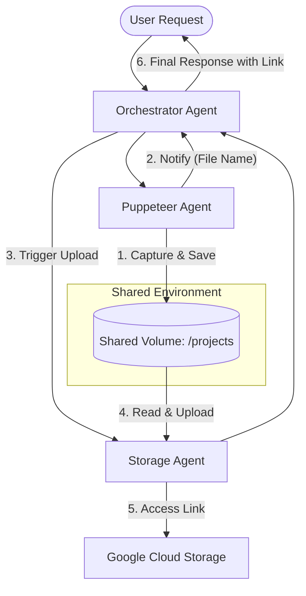

# Technical Documentation: Multi-Step Screenshot Workflow

## Overview
The Multi-Step Screenshot Workflow enables the FinOptiAgents platform to capture web screenshots, store them temporarily in a shared workspace, and **automatically** upload them to permanent cloud storage (GCS). This is achieved through a shared Docker volume and synchronized logic triggered by the Orchestrator Agent.

## Architecture



## Configuration Details

### 1. Shared Volume (Docker Compose)
A named volume `finopti-agent-shared-data` is defined and mounted across relevant services.

*   **Internal Mount Path:** `/projects`
*   **Docker Volume Name:** `finopti-agent-shared-data`

### 2. GCS Storage
*   **Dedicated Bucket:** `finoptiagents_puppeteer_screenshots`
*   **Security Policy:** 
    *   **No Console Links:** Google Cloud Console links are strictly prohibited in user-facing responses to prevent infrastructure exposure.
    *   **Secure Access URLs:** Screenshots are made selectively public at the object level to fix access denied issues while keeping the bucket private.

## Component Implementation

### Puppeteer Agent
**File:** `sub_agents/puppeteer_agent_adk/agent.py`
The agent saves screenshots to `/projects/<filename>.png` and **must** append `File Name: <filename>.png` to its final response. This string acts as the trigger for the Orchestrator's automated upload logic.

### Storage Agent
**File:** `sub_agents/storage_agent_adk/agent.py`
The `upload_file_from_local` tool handles the GCS upload and generates a **Secure Access Link**. It also ensures that only the HTTPS link is returned, and any Console Link generation is disabled.

### Orchestrator Agent
**File:** `orchestrator_adk/agent.py`
The Orchestrator implements an automated chaining mechanism:
1.  Detects the `File Name:` pattern in the Puppeteer Agent's response.
2.  Routes a background `upload` request to the Storage Agent without explicit user input.
3.  Extracts the resulting `signed_url` (or fallback) and appends it to the final user response.

## Debugging & Troubleshooting

### 1. Verifying the Shared Volume
To check if the screenshot was successfully saved, you can query the Filesystem Agent:
```bash
curl -X POST http://localhost:9080/agent/filesystem/execute \
  -H "Content-Type: application/json" \
  -H "X-User-Email: admin@cloudroaster.com" \
  -d '{"prompt": "List files in /projects"}'
```

### 2. Checking Security Compliance
Verify that the output does **not** contain any URL starting with `https://console.cloud.google.com`.

### 3. Common Issues
*   **Access Denied:** If the HTTPS link fails, check the Storage Agent logs for `make_public()` errors.
*   **Automation Failure:** If the upload doesn't trigger, verify the Puppeteer Agent includes `File Name: <filename>.png` exactly in its output.

## Example Automated Workflow
**User Prompt:** > "Take a screenshot of https://www.google.com"

**System Action:**
1.  **Puppeteer** captures and saves `screenshot.png` to `/projects`.
2.  **Orchestrator** detects the filename and triggers **Storage Agent**.
3.  **Storage Agent** uploads to `finoptiagents_puppeteer_screenshots` and makes the file public.
4.  **User** receives a confirmation message with the working HTTPS link.
