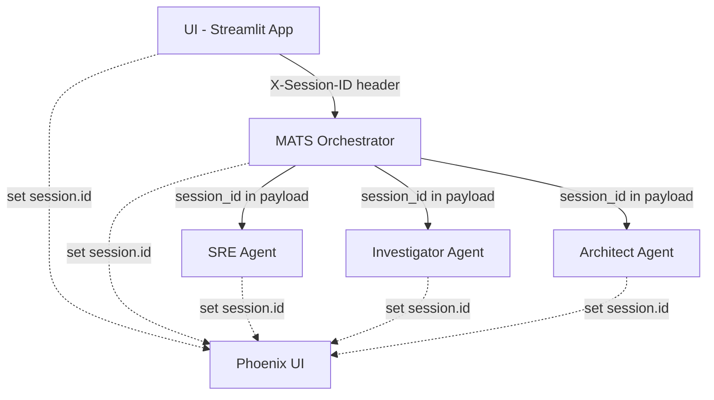

# Phoenix Session Tracking - Developer Guide

**Version:** 2.0  
**Last Updated:** 2026-02-07  
**Status:** Production Ready

## Table of Contents

1. [Overview](#overview)
2. [Architecture](#architecture)
3. [Tools & Technologies](#tools--technologies)
4. [Core Concepts](#core-concepts)
5. [Implementation Details](#implementation-details)
6. [Developer Guide](#developer-guide)
7. [Phoenix UI Guide](#phoenix-ui-guide)
8. [Troubleshooting](#troubleshooting)
9. [Future Enhancements](#future-enhancements)

---

## Overview

### What is Session Tracking?

Session tracking enables grouping of multiple distributed traces under a single logical user session. In the FinOpti MATS platform, a single user investigation may trigger multiple agents (Orchestrator, SRE, Investigator, Architect), each generating separate traces. Session tracking allows Phoenix to group all these traces together for complete visibility.

### Problem Statement

**Before Implementation:**
- Each agent generated independent traces
- No way to link traces from the same user investigation
- Phoenix Sessions tab was empty
- Difficult to debug multi-agent workflows

**After Implementation:**
- All traces from one investigation grouped under a single `session_id`
- Complete trace hierarchy visible in Phoenix
- End-to-end observability across agent boundaries
- Easy debugging of complex multi-agent interactions

### Benefits

- ✅ **Complete Visibility**: See entire investigation flow in one place
- ✅ **Debugging**: Trace issues across multiple agents
- ✅ **Performance Analysis**: Measure total investigation time and bottlenecks
- ✅ **User Experience**: Track user behavior across sessions
- ✅ **Compliance**: Audit trails for investigations

---

## Architecture

### System Layers



### Data Flow

```
┌─────────────────────────────────────────────────────────────┐
│ 1. User Login → UI generates session_id (persistent)       │
│    session_id = uuid4()                                     │
└─────────────────────────────────────────────────────────────┘
                            ↓
┌─────────────────────────────────────────────────────────────┐
│ 2. User Request → UI sends X-Session-ID header              │
│    POST /ask                                                │
│    Headers: { "X-Session-ID": "<session_id>" }             │
└─────────────────────────────────────────────────────────────┘
                            ↓
┌─────────────────────────────────────────────────────────────┐
│ 3. Orchestrator extracts session_id                         │
│    session_id = request.headers.get('X-Session-ID')         │
│    span.set_attribute(SESSION_ID, session_id)               │
└─────────────────────────────────────────────────────────────┘
                            ↓
┌─────────────────────────────────────────────────────────────┐
│ 4. Orchestrator delegates to sub-agents                     │
│    payload = {                                              │
│      "message": prompt,                                     │
│      "session_id": session_id,  ← Explicit propagation      │
│      "headers": trace_headers    ← Trace context            │
│    }                                                        │
└─────────────────────────────────────────────────────────────┘
                            ↓
┌─────────────────────────────────────────────────────────────┐
│ 5. Sub-agents extract session_id from payload               │
│    session_id = payload.get("session_id")                   │
│    span.set_attribute(SESSION_ID, session_id)               │
└─────────────────────────────────────────────────────────────┘
                            ↓
┌─────────────────────────────────────────────────────────────┐
│ 6. Phoenix extracts session.id using session_extractor.py   │
│    session_id(span) → returns span.attributes['session.id'] │
└─────────────────────────────────────────────────────────────┘
```

---

## Tools & Technologies

### OpenTelemetry

**Purpose**: Distributed tracing framework  
**Version**: Latest (via `opentelemetry-api`, `opentelemetry-sdk`)

**Key Components:**
- **Tracer Provider**: Manages trace creation
- **Spans**: Individual units of work
- **Context Propagation**: Carries trace/span info across services
- **Span Attributes**: Metadata attached to spans

**Usage in Platform:**
```python
from opentelemetry import trace, propagate
from opentelemetry.sdk import trace as trace_sdk

# Create tracer
tracer = trace.get_tracer(__name__)

# Create span
with tracer.start_as_current_span("operation_name") as span:
    span.set_attribute("custom.attribute", "value")
    # ... work ...

# Propagate context
headers = {}
propagate.inject(headers)  # Injects traceparent header
```

### Phoenix (Arize AI)

**Purpose**: AI observability and trace visualization  
**Version**: Latest (via `arize-phoenix`)

**Key Features:**
- Session-based trace grouping
- Trace visualization
- Span attributes inspection
- Performance analytics

**Configuration:**
```python
from phoenix.otel import register

tracer_provider = register(
    project_name="finoptiagents-MATS",
    endpoint="http://phoenix:6006/v1/traces"
)
```

### OpenInference

**Purpose**: OpenTelemetry semantic conventions for AI/LLM applications  
**Package**: `openinference-instrumentation-google-adk`

**Key Attributes:**
- `SpanAttributes.SESSION_ID` → `"session.id"`
- `SpanAttributes.OPENINFERENCE_SPAN_KIND` → `"CHAIN"`, `"AGENT"`, etc.
- `SpanAttributes.INPUT_VALUE` → Input to LLM
- `SpanAttributes.OUTPUT_VALUE` → Output from LLM

**Usage:**
```python
from openinference.semconv.trace import SpanAttributes
from openinference.instrumentation.google_adk import GoogleADKInstrumentor

# Instrument Google ADK
GoogleADKInstrumentor().instrument(tracer_provider=tracer_provider)

# Set session attribute
span.set_attribute(SpanAttributes.SESSION_ID, session_id)
```

### Session Extractor Plugin

**Purpose**: Custom Phoenix plugin to extract session IDs from spans  
**File**: [agent-observability/session_extractor.py](file:///Users/robinkv/dev_workplace/all_codebase/auth_micro_agents/finopti-platform/agent-observability/session_extractor.py)

**How It Works:**
1. Phoenix calls `session_id(span)` for each span
2. Function checks for session attributes in priority order:
   - `session.id` (OpenInference standard)
   - `session_id` (custom)
   - `openinference.session.id` (alternative)
   - `user.email` (fallback)
3. Returns first found value or `None`

**Code:**
```python
def session_id(span) -> Optional[str]:
    attributes = span.attributes or {}
    
    # Priority 1: OpenInference standard
    if 'session.id' in attributes:
        return str(attributes['session.id'])
    
    # Priority 2: Custom attribute
    if 'session_id' in attributes:
        return str(attributes['session_id'])
    
    # Priority 3: Alternative
    if 'openinference.session.id' in attributes:
        return str(attributes['openinference.session.id'])
    
    # Fallback: User-based grouping
    if 'user.email' in attributes:
        return f"user:{attributes['user.email']}"
    
    return None
```

---

## Core Concepts

### 1. Session vs. Trace

**Session:**
- Logical grouping of related traces
- Persistent across multiple requests
- User-controlled lifecycle (via "New Investigation" button)
- Identified by UUID (`session_id`)

**Trace:**
- Single distributed transaction
- One trace per agent invocation
- Auto-generated per request
- Identified by `trace_id`

**Relationship:**
```
Session (abc-123)
├─ Trace 1 (List VMs request)
│  ├─ Span: UI request
│  ├─ Span: Orchestrator
│  └─ Span: SRE Agent
├─ Trace 2 (List buckets request)
│  ├─ Span: UI request
│  ├─ Span: Orchestrator
│  └─ Span: Investigator Agent
└─ Trace 3 (Generate RCA)
   ├─ Span: Orchestrator
   └─ Span: Architect Agent
```

### 2. Span Attributes

Spans can have custom attributes for metadata:

```python
span.set_attribute("session.id", "abc-123")
span.set_attribute("user.email", "dev@example.com")
span.set_attribute("agent.name", "mats-sre")
span.set_attribute("agent.type", "triage")
```

Phoenix uses these attributes for:
- Session grouping
- Filtering
- Search
- Analytics

### 3. Context Propagation

OpenTelemetry uses the `traceparent` header (W3C standard) to propagate trace context:

**Format:**
```
traceparent: 00-<trace_id>-<parent_span_id>-<flags>
```

**Example:**
```
traceparent: 00-4bf92f3577b34da6a3ce929d0e0e4736-00f067aa0ba902b7-01
```

**Flow:**
```python
# Service A (Orchestrator)
headers = {}
propagate.inject(headers)  # Adds traceparent
# headers = {"traceparent": "00-..."}

# HTTP Request to Service B
requests.post(url, json=payload, headers=headers)

# Service B (Sub-agent)
parent_ctx = propagate.extract(request.headers)
with tracer.start_as_current_span("work", context=parent_ctx):
    # This span is now a child of orchestrator's span
    pass
```

### 4. Project Name Consistency

All agents in the same system **must** use the same Phoenix project name for session grouping to work:

```python
# ❌ WRONG - Different project names
register(project_name="mats-orchestrator")  # Orchestrator
register(project_name="mats-sre")           # SRE Agent

# ✅ CORRECT - Same project name
register(project_name="finoptiagents-MATS")  # All agents
```

---

## Implementation Details

### Component Changes

#### 1. UI Layer (ui/app.py)

**Changes:**
- Separated `active_session_id` (persistent) from `active_trace_id` (per-request)
- Send `X-Session-ID` header with every request
- Generate new session on "New Investigation" button

**Code:**
```python
# Initialize session state
if 'active_session_id' not in st.session_state:
    st.session_state.active_session_id = str(uuid.uuid4())

# Send request with session header
response = requests.post(
    url,
    json={"prompt": prompt},
    headers={
        "X-User-Email": user_email,
        "X-Session-ID": st.session_state.active_session_id
    }
)
```

#### 2. MATS Orchestrator (mats-orchestrator/main.py)

**Changes:**
- Extract `X-Session-ID` from request headers
- Pass to `run_investigation_async` function

**Code:**
```python
@app.route('/ask', methods=['POST'])
def ask():
    user_email = request.headers.get('X-User-Email')
    session_id = request.headers.get('X-Session-ID')
    
    if session_id:
        logger.info(f"Received session ID from UI: {session_id}")
    
    # ... delegate to agent.py
```

#### 3. MATS Orchestrator Agent (mats-orchestrator/agent.py)

**Changes:**
- Accept `provided_session_id` parameter
- Set `session.id` attribute on current span
- Store in session object for delegation

**Code:**
```python
async def run_investigation_async(
    user_request: str,
    provided_session_id: str = None,
    ...
):
    session_id = provided_session_id or str(uuid.uuid4())
    
    # Set session.id on current span
    current_span = trace.get_current_span()
    if current_span and current_span.is_recording():
        current_span.set_attribute(SpanAttributes.SESSION_ID, session_id)
        logger.info(f"Set session.id={session_id} on current span")
```

#### 4. Orchestrator Delegation (mats-orchestrator/delegation.py)

**Changes:**
- Pass `session_id` in payload to all sub-agents

**Code:**
```python
async def delegate_to_sre(...):
    payload = {
        "message": prompt,
        "session_id": session_id,  # ← Added
        "headers": trace_headers
    }
    result = await _http_post(SRE_AGENT_URL, payload)
```

#### 5. MATS Sub-Agents (Architect, Investigator, SRE)

**Changes:**
- Extract `session_id` from payload
- Set `session.id` attribute on span
- Ensure project name is `"finoptiagents-MATS"`

**Code Pattern (applied to all 3 agents):**
```python
# Phoenix registration
tracer_provider = register(
    project_name="finoptiagents-MATS",  # ← Must match orchestrator
    endpoint=os.getenv("PHOENIX_COLLECTOR_ENDPOINT", "http://phoenix:6006/v1/traces")
)

async def process_request(prompt_or_payload: Any):
    # Extract session_id from payload
    session_id = None
    if isinstance(prompt_or_payload, dict):
        session_id = prompt_or_payload.get("session_id")
    
    # Extract trace context
    trace_context = {}
    if isinstance(prompt_or_payload, dict):
        trace_context = prompt_or_payload.get("headers", {})
    
    parent_ctx = propagate.extract(trace_context) if trace_context else None
    
    # Create span with session.id
    with tracer.start_as_current_span(
        "operation_name",
        context=parent_ctx,
        attributes={...}
    ) as span:
        # Set session.id for Phoenix grouping
        if session_id and span and span.is_recording():
            span.set_attribute(SpanAttributes.SESSION_ID, session_id)
            logger.info(f"[{session_id}] Agent: Set session.id on span")
        
        # ... agent logic ...
```

**Specific Changes:**

**Architect Agent** ([agent.py:24-30](file:///Users/robinkv/dev_workplace/all_codebase/auth_micro_agents/finopti-platform/mats-agents/mats-architect-agent/agent.py#L24-L30)):
- Fixed project name from dynamic to `"finoptiagents-MATS"`
- Added session extraction and attribute setting

**Investigator Agent** ([agent.py:202-223](file:///Users/robinkv/dev_workplace/all_codebase/auth_micro_agents/finopti-platform/mats-agents/mats-investigator-agent/agent.py#L202-L223)):
- Already had correct project name
- Added session extraction and attribute setting

**SRE Agent** ([agent.py:318-340](file:///Users/robinkv/dev_workplace/all_codebase/auth_micro_agents/finopti-platform/mats-agents/mats-sre-agent/agent.py#L318-L340)):
- Already had correct project name
- Added session extraction and attribute setting

#### 6. Session Extractor Plugin (agent-observability/session_extractor.py)

**Status:** Already existed, no changes needed

**Purpose:** Phoenix uses this to extract `session.id` from span attributes

---

## Developer Guide

### Adding Session Tracking to a New Agent

Follow this checklist when adding a new agent to the platform:

#### Step 1: Phoenix Registration

```python
from phoenix.otel import register
from openinference.instrumentation.google_adk import GoogleADKInstrumentor

# Initialize tracing with CORRECT project name
tracer_provider = register(
    project_name="finoptiagents-MATS",  # ← CRITICAL: Must match
    endpoint=os.getenv("PHOENIX_COLLECTOR_ENDPOINT", "http://phoenix:6006/v1/traces"),
    set_global_tracer_provider=True
)

# Instrument Google ADK (if using ADK)
GoogleADKInstrumentor().instrument(tracer_provider=tracer_provider)
```

#### Step 2: Extract Session from Payload

```python
async def process_request(prompt_or_payload: Any):
    # Extract session_id
    session_id = None
    if isinstance(prompt_or_payload, dict):
        session_id = prompt_or_payload.get("session_id")
    
    # Extract trace context for parent-child linking
    trace_context = {}
    if isinstance(prompt_or_payload, dict):
        trace_context = prompt_or_payload.get("headers", {})
```

#### Step 3: Create Span with Session Attribute

```python
    from opentelemetry import propagate, trace
    from openinference.semconv.trace import SpanAttributes
    
    parent_ctx = propagate.extract(trace_context) if trace_context else None
    tracer = trace.get_tracer(__name__)
    
    with tracer.start_as_current_span(
        "your_operation_name",
        context=parent_ctx,
        attributes={
            SpanAttributes.OPENINFERENCE_SPAN_KIND: "CHAIN",  # or "AGENT"
            "agent.name": "your-agent-name",
            "agent.type": "your-agent-type"
        }
    ) as span:
        # Set session.id for Phoenix grouping
        if session_id and span and span.is_recording():
            span.set_attribute(SpanAttributes.SESSION_ID, session_id)
            logger.info(f"[{session_id}] YourAgent: Set session.id on span")
        
        # Your agent logic here
        result = await your_agent_function()
        return result
```

#### Step 4: Update Caller to Pass Session ID

If your agent is called by the orchestrator, update the delegation function:

```python
# In delegation.py or caller
async def delegate_to_your_agent(..., session_id: str):
    payload = {
        "message": prompt,
        "session_id": session_id,  # ← Add this
        "headers": trace_headers
    }
    result = await _http_post(YOUR_AGENT_URL, payload)
    return result
```

#### Step 5: Rebuild and Test

```bash
# Rebuild your agent container
docker-compose build --no-cache your-agent

# Restart service
docker-compose up -d your-agent

# Check logs
docker-compose logs your-agent | grep "session.id"

# Expected output:
# [abc-123] YourAgent: Set session.id on span
```

### Testing Session Tracking

#### Manual Testing

1. **Start Services:**
   ```bash
   cd /Users/robinkv/dev_workplace/all_codebase/auth_micro_agents/finopti-platform
   docker-compose up -d
   ```

2. **Open UI:**
   - Navigate to http://localhost:8501
   - Login
   - Note the session ID at the top

3. **Make Request:**
   - Enter a prompt: "Investigate Cloud Run errors"
   - Wait for completion

4. **Check Logs:**
   ```bash
   # Orchestrator
   docker-compose logs mats-orchestrator | grep "session.id"
   
   # Sub-agents
   docker-compose logs mats-sre-agent | grep "session.id"
   docker-compose logs mats-investigator-agent | grep "session.id"
   docker-compose logs mats-architect-agent | grep "session.id"
   ```

5. **Verify in Phoenix:**
   - Open http://localhost:6006
   - Go to "Sessions" tab
   - Find your session by ID
   - Verify traces are grouped

#### Automated Testing

```python
import pytest
from opentelemetry import trace

def test_session_tracking():
    """Verify session.id is set on spans"""
    from mats_sre_agent import agent
    
    # Mock request with session_id
    payload = {
        "message": "test",
        "session_id": "test-session-123"
    }
    
    # Process request
    result = await agent.process_request(payload)
    
    # Get current span
    current_span = trace.get_current_span()
    
    # Verify session.id attribute
    assert current_span.attributes.get("session.id") == "test-session-123"
```

### Common Patterns

#### Pattern 1: Agent-to-Agent Communication

```python
# Caller (Orchestrator)
async def call_sub_agent(session_id: str):
    # Inject trace context
    headers = {}
    propagate.inject(headers)
    
    # Send request with session_id
    payload = {
        "message": "do work",
        "session_id": session_id,
        "headers": headers
    }
    
    response = await http_post(url, payload)
    return response

# Receiver (Sub-agent)
async def process_request(payload: dict):
    session_id = payload.get("session_id")
    trace_headers = payload.get("headers", {})
    
    # Extract parent context
    parent_ctx = propagate.extract(trace_headers)
    
    # Create child span
    with tracer.start_as_current_span("work", context=parent_ctx) as span:
        span.set_attribute(SpanAttributes.SESSION_ID, session_id)
        # ... work ...
```

#### Pattern 2: UI-to-Backend Communication

```python
# UI (Streamlit)
session_id = st.session_state.active_session_id
response = requests.post(
    url,
    json={"prompt": prompt},
    headers={"X-Session-ID": session_id}
)

# Backend (Flask)
@app.route('/ask', methods=['POST'])
def ask():
    session_id = request.headers.get('X-Session-ID')
    # ... process with session_id
```

#### Pattern 3: Long-Running Operations

```python
async def long_operation(session_id: str):
    """Operation with multiple sub-steps"""
    tracer = trace.get_tracer(__name__)
    
    with tracer.start_as_current_span("long_operation") as parent_span:
        parent_span.set_attribute(SpanAttributes.SESSION_ID, session_id)
        
        # Step 1
        with tracer.start_as_current_span("step_1") as span1:
            span1.set_attribute(SpanAttributes.SESSION_ID, session_id)
            await step_1()
        
        # Step 2
        with tracer.start_as_current_span("step_2") as span2:
            span2.set_attribute(SpanAttributes.SESSION_ID, session_id)
            await step_2()
```

---

## Phoenix UI Guide

### Navigating Sessions

1. **Access Phoenix:**
   - URL: http://localhost:6006
   - Select project: **finoptiagents-MATS**

2. **Sessions Tab:**
   - Shows all unique sessions
   - Displays session ID, first input, and trace count
   - Sort by time or trace count

3. **Session Detail View:**
   - Click on a session to view all traces
   - See trace timeline
   - Inspect individual spans

### Expected Output

#### Sessions List


**What to Look For:**
- ✅ Session ID matches UI
- ✅ First input shows user query
- ✅ Trace count > 1 (multiple agents)
- ✅ Recent timestamp

#### Session Detail (Trace Hierarchy)


**Expected Structure:**
```
Session: 80ddaa45962e4fd588fdf5fe384147d0
├─ Trace 1: run_investigation
│  ├─ Span: orchestrator (parent)
│  ├─ Span: sre_log_analysis (child)
│  ├─ Span: investigator_code_analysis (child)
│  └─ Span: architect_synthesis (child)
```

**What to Look For:**
- ✅ Multiple traces under one session
- ✅ Parent-child span relationships
- ✅ Correct span names
- ✅ Timing information

#### Span Attributes

Click on any span to view attributes:

```json
{
  "session.id": "80ddaa45962e4fd588fdf5fe384147d0",
  "agent.name": "mats-sre",
  "agent.type": "triage",
  "openinference.span.kind": "CHAIN",
  "user.email": "dev@example.com"
}
```

**Key Attributes:**
- `session.id` - Session identifier (MUST be present)
- `agent.name` - Agent identifier
- `agent.type` - Agent role
- `openinference.span.kind` - Operation type

### Phoenix Queries

#### Find All Sessions for a User

1. Go to Sessions tab
2. Search bar: Enter user email
3. Filter by date range if needed

#### Find Long-Running Investigations

1. Sessions tab
2. Sort by "Last Trace" descending
3. Look for sessions with high trace counts

#### Debug a Specific Session

1. Copy session ID from UI
2. Paste into Phoenix search
3. View all traces
4. Click on failing span
5. Inspect attributes and error messages

---

## Troubleshooting

### Issue: Phoenix Sessions Tab is Empty

**Symptoms:**
- No sessions appear in Phoenix
- Traces exist but not grouped

**Causes:**
1. Session extractor not loaded
2. `session.id` attribute not set
3. Wrong project name

**Solutions:**

**Check Session Extractor:**
```bash
# Verify file exists
ls -la agent-observability/session_extractor.py

# Check Phoenix logs
docker-compose logs phoenix | grep "session"

# Restart Phoenix
docker-compose restart phoenix
```

**Verify session.id Attribute:**
```bash
# Check agent logs
docker-compose logs mats-orchestrator | grep "Set session.id"

# Expected output:
# Set session.id=abc-123 on current span
```

**Check Project Names:**
```bash
# Grep all agent code for project_name
grep -r "project_name=" mats-agents/

# All should show: project_name="finoptiagents-MATS"
```

### Issue: Traces Not Linked (No Parent-Child)

**Symptoms:**
- Traces appear in session but not nested
- Flat trace list instead of hierarchy

**Cause:**
- Trace context not propagated

**Solution:**

**Verify Context Propagation:**
```python
# In orchestrator delegation
headers = {}
propagate.inject(headers)  # Must be called
payload["headers"] = headers  # Must be included

# In sub-agent
trace_context = payload.get("headers", {})  # Must extract
parent_ctx = propagate.extract(trace_context)  # Must propagate
```

**Check Logs:**
```bash
# Orchestrator should log
docker-compose logs mats-orchestrator | grep "traceparent"
# Output: Trace context injected with traceparent: 00-...
```

### Issue: Some Agents Missing from Session

**Symptoms:**
- Session shows orchestrator trace only
- Sub-agent traces not appearing

**Causes:**
1. Sub-agent not setting `session.id`
2. Sub-agent using different project name
3. Sub-agent container not rebuilt

**Solutions:**

**Check Sub-Agent Logs:**
```bash
docker-compose logs mats-sre-agent | grep "session.id"
# Expected: [abc-123] SRE: Set session.id on span
```

**Verify Project Name:**
```bash
# Check agent code
grep "project_name" mats-agents/mats-sre-agent/agent.py
# Should be: project_name="finoptiagents-MATS"
```

**Rebuild Container:**
```bash
docker-compose build --no-cache mats-sre-agent
docker-compose up -d mats-sre-agent
```

### Issue: Session ID Mismatch

**Symptoms:**
- Phoenix shows different session ID than UI
- Sessions not grouping as expected

**Cause:**
- Session ID not being passed correctly

**Solution:**

**Check UI Logs:**
```python
# In ui/app.py, add logging
logger.info(f"Sending request with session_id: {st.session_state.active_session_id}")
```

**Check Orchestrator Reception:**
```bash
docker-compose logs mats-orchestrator | grep "Received session ID from UI"
# Output should match UI session ID
```

**Verify Header Transmission:**
```python
# In ui/app.py
headers = {
    "X-Session-ID": st.session_state.active_session_id  # Check this line
}
```

### Issue: "New Investigation" Not Creating New Session

**Symptoms:**
- Clicking button doesn't create new session
- Old session ID persists

**Solution:**

**Check UI Code:**
```python
# In ui/app.py
if st.button("🆕 New Investigation"):
    st.session_state.active_session_id = str(uuid.uuid4())  # Must regenerate
    st.rerun()  # Must rerun to update UI
```

### Debug Checklist

When troubleshooting session tracking issues:

- [ ] Phoenix is running: `docker-compose ps phoenix`
- [ ] Session extractor exists: `ls agent-observability/session_extractor.py`
- [ ] All agents use same project: `"finoptiagents-MATS"`
- [ ] Orchestrator logs show session reception
- [ ] Sub-agent logs show session.id setting
- [ ] Containers rebuilt after code changes
- [ ] Phoenix UI shows correct project selected
- [ ] Browser cache cleared (Cmd+Shift+R)

---

## Future Enhancements

### 1. General Sub-Agents Integration

**Status:** Not yet implemented  
**Scope:** `sub_agents/` directory (GitHub, GCloud, Storage, etc.)

**Approach:**
- Review `orchestrator_adk` for session propagation
- Add `X-Session-ID` header forwarding
- Update each sub-agent with session tracking pattern

**Estimated Effort:** 4-6 hours

### 2. Performance Metrics

**Goal:** Aggregate session-level metrics

**Metrics to Track:**
- Total investigation time
- Agent utilization
- Error rates per session
- User satisfaction (manual input)

**Implementation:**
```python
# In Phoenix or separate analytics
def analyze_session(session_id: str):
    traces = get_traces_by_session(session_id)
    
    return {
        "total_time": sum(t.duration for t in traces),
        "agent_count": len(set(t.agent_name for t in traces)),
        "error_count": sum(1 for t in traces if t.has_error),
        "success_rate": calculate_success_rate(traces)
    }
```

### 3. Session Replay

**Goal:** Replay investigation for debugging

**Features:**
- Export session as JSON
- Replay with same inputs
- Compare outputs

**Use Cases:**
- Regression testing
- Debugging intermittent failures
- Training new agents

### 4. Multi-User Sessions

**Goal:** Support collaborative investigations

**Features:**
- Multiple users join same session
- Real-time updates
- Shared trace visibility

**Challenges:**
- Concurrency control
- Session ownership
- Access control

### 5. Session Analytics Dashboard

**Goal:** Aggregate insights across all sessions

**Views:**
- Session count over time
- Average investigation duration
- Most common failure modes
- Agent performance comparison

**Tools:**
- Phoenix native analytics
- Custom Grafana dashboards
- BigQuery integration

---

## Appendix

### A. File Locations

**Core Components:**
- UI: [ui/app.py](file:///Users/robinkv/dev_workplace/all_codebase/auth_micro_agents/finopti-platform/ui/app.py)
- Orchestrator Main: [mats-agents/mats-orchestrator/main.py](file:///Users/robinkv/dev_workplace/all_codebase/auth_micro_agents/finopti-platform/mats-agents/mats-orchestrator/main.py)
- Orchestrator Agent: [mats-agents/mats-orchestrator/agent.py](file:///Users/robinkv/dev_workplace/all_codebase/auth_micro_agents/finopti-platform/mats-agents/mats-orchestrator/agent.py)
- Delegation: [mats-agents/mats-orchestrator/delegation.py](file:///Users/robinkv/dev_workplace/all_codebase/auth_micro_agents/finopti-platform/mats-agents/mats-orchestrator/delegation.py)
- SRE Agent: [mats-agents/mats-sre-agent/agent.py](file:///Users/robinkv/dev_workplace/all_codebase/auth_micro_agents/finopti-platform/mats-agents/mats-sre-agent/agent.py)
- Investigator Agent: [mats-agents/mats-investigator-agent/agent.py](file:///Users/robinkv/dev_workplace/all_codebase/auth_micro_agents/finopti-platform/mats-agents/mats-investigator-agent/agent.py)
- Architect Agent: [mats-agents/mats-architect-agent/agent.py](file:///Users/robinkv/dev_workplace/all_codebase/auth_micro_agents/finopti-platform/mats-agents/mats-architect-agent/agent.py)

**Observability:**
- Session Extractor: [agent-observability/session_extractor.py](file:///Users/robinkv/dev_workplace/all_codebase/auth_micro_agents/finopti-platform/agent-observability/session_extractor.py)
- Phoenix Config: [agent-observability/docker-compose.yaml](file:///Users/robinkv/dev_workplace/all_codebase/auth_micro_agents/finopti-platform/agent-observability/docker-compose.yaml)

### B. Environment Variables

```bash
# Phoenix Configuration
PHOENIX_COLLECTOR_ENDPOINT=http://phoenix:6006/v1/traces
PHOENIX_SESSION_EVALUATOR_FILE_PATH=/app/session_extractor.py

# GCP Project
GCP_PROJECT_ID=your-project-id

# Service URLs
SRE_AGENT_URL=http://mats-sre-agent:8081
INVESTIGATOR_AGENT_URL=http://mats-investigator-agent:8082
ARCHITECT_AGENT_URL=http:// mats-architect-agent:8083
```

### C. Key Commands

**Development:**
```bash
# Rebuild all MATS containers
docker-compose build --no-cache mats-orchestrator mats-sre-agent mats-investigator-agent mats-architect-agent

# Restart services
docker-compose up -d

# View logs
docker-compose logs -f mats-orchestrator
docker-compose logs --tail=100 mats-sre-agent | grep "session"
```

**Debugging:**
```bash
# Check container status
docker-compose ps

# Inspect container
docker exec -it finopti-platform-mats-orchestrator-1 bash

# Verify Python packages
docker exec finopti-platform-mats-orchestrator-1 pip list | grep -i phoenix

# Check file mounts
docker exec finopti-platform-phoenix-1 ls -la /app/session_extractor.py
```

**Cleanup:**
```bash
# Remove all containers
docker-compose down

# Remove volumes (WARNING: Deletes data)
docker-compose down -v

# Rebuild from scratch
docker-compose down
docker-compose build --no-cache
docker-compose up -d
```

### D. References

**Documentation:**
- [OpenTelemetry Python](https://opentelemetry.io/docs/languages/python/)
- [Arize Phoenix](https://docs.arize.com/phoenix)
- [OpenInference Semantic Conventions](https://github.com/Arize-ai/openinference)
- [W3C Trace Context](https://www.w3.org/TR/trace-context/)

**Related Docs:**
- [Agent Observability README](file:///Users/robinkv/dev_workplace/all_codebase/auth_micro_agents/finopti-platform/agent-observability/README.md)
- [AI Agent Development Guide](file:///Users/robinkv/dev_workplace/all_codebase/auth_micro_agents/finopti-platform/AI_AGENT_DEVELOPMENT_GUIDE.md)

---

## Changelog

### v2.0 (2026-02-07)
- ✅ Integrated session tracking across all MATS sub-agents
- ✅ Fixed project name consistency
- ✅ Added comprehensive developer documentation
- ✅ Verified end-to-end session grouping in Phoenix

### v1.0 (2026-02-05)
- ✅ Created session extractor plugin
- ✅ Fixed UI session management
- ✅ Added session tracking to orchestrator
- ✅ Verified Phoenix session grouping

---

**Questions or Issues?**  
Contact the platform team or create an issue in the repository.
