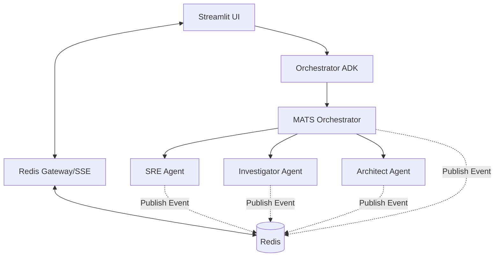

# MATS Platform: Architectural Documentation & Design

## 1. Overview
The MATS (Multimodal Autonomous Troubleshooting System) is an agentic microservices platform designed for autonomous cloud incident investigation and remediation. It leverages an event-driven architecture powered by a **Redis Event Bridge** to provide real-time visibility into multi-agent reasoning, tool calls, and investigation progress.

---

## 2. Technology Stack

### Core Frameworks & Languages
- **Agent Framework**: [Google ADK](https://github.com/google/generative-ai-python) (Agent Development Kit) for sophisticated reasoning and tool use.
- **Frontend**: **Streamlit** for a reactive, chat-based user interface.
- **Microservices**: **FastAPI** (Orchestrators/Gateway) and **Flask** (Sub-agents).
- **Runtime**: **Python 3.10+** & **Node.js** (for specific MCP servers).

### Infrastructure & Messaging
- **Messaging/State**: **Redis** (Pub/Sub for live streaming, Session storage).
- **API Gateway**: **Apache APISIX** for traffic routing, authentication, and service mesh management.
- **Containerization**: **Docker & Docker Compose** for local and production deployment.

### Observability & Tracing
- **Tracing Backend**: **Arize Phoenix** (OpenInference standard).
- **Instrumentation**: **OpenTelemetry (OTEL)** for distributed tracing across services.

---

## 3. Design & Architecture

### Event-Driven Orchestration
The system uses a "Single Source of Truth" event bridge. As agents work, they publish standardized events to Redis, which are then streamed to the UI via Server-Sent Events (SSE).

### Key Architectural Patterns
1. **Multi-Hop Delegation**: Large tasks are decomposed by the **MATS Orchestrator** and delegated sequentially to specialized agents (SRE -> Investigator -> Architect).
2. **Dynamic Channel Targeting**: Redis channels are dynamically constructed as `channel:user_{email}:session_{id}`, ensuring that the UI only receives events for the active user session.
3. **Async Progressive Rendering**: The UI initiates a background job and immediately connects to a Redis stream. This allows the UI to render "Thoughts" and "Tool Calls" as they happen, rather than waiting for a full HTTP timeout.

---

## 4. Integration & Data Exchange

### Propagation Chain
To maintain context across 4+ microservice hops, the system propagates a standard context payload:
- **`session_id`**: For grouping all logs/traces in Phoenix.
- **`user_email`**: For Redis channel targeting and IAM-bound tool calls.
- **`traceparent`**: W3C standard for distributed tracing.

### Standardized Event Schema
All agents use a shared `RedisEventPublisher` to emit `AgentEvent` objects:
- `STATUS_UPDATE`: High-level progress (UI progress bars).
- `TOOL_CALL`: Visibility into MCP tool execution.
- `OBSERVATION`: Raw output from tools.
- `THOUGHT`: Internal reasoning/Chain-of-Thought.
- `ERROR`: Exception details.

---

## 5. Security & Isolation

### User-Scoped Isolation
- **Logical Air-Gapping**: Redis channels are keyed by the user's authenticated email address.
- **Data Governance**: Sub-agents use the `user_email` to set the execution context for GCP/GitHub operations, ensuring audit logs reflect the actual requester.

### API Mesh Security
- **Internal Only**: Sub-agents (SRE, Investigator, etc.) are NOT exposed to the public internet. They reside on an internal Docker network and are only accessible via APISIX with valid authentication headers.
- **JWT Propagation**: APISIX validates OAuth tokens and injects `X-User-Email` into downstream requests.

---

## 6. Implementation Notes

### The "Sub-Agent Silence" Fix
A critical design requirement discovered during implementation was the need for **Context Propagation** in background workers. Because agents often run in async loops or executors, we implemented `ContextVar` based tracking to ensure `user_email` and `session_id` are available to deep helper functions without passing them through every signature.

### Performance Optimizations & Streaming Reliability
- **X-Accel-Buffering**: Disabled in APISIX/Nginx via headers (`X-Accel-Buffering: no`) to prevent proxy buffering of live agent thoughts, enabling true real-time streaming.
- **Non-Blocking Orchestration**: The MATS Orchestrator uses `asyncio` Task Groups and ThreadPoolExecutors to ensure that long-running investigations do not block the acceptance of new status updates or concurrent delegation.
- **SSE Connection Management**: The UI implements a "Stream-First" approach, ensuring the Redis listener is established BEFORE the HTTP request is fired toward the Orchestrator, preventing "Initial Message Loss."

## 7. Technical Refinements (Lessons Learned)

### Context Propagation via ContextVars
Due to the heavily asynchronous nature of ADK and Flask, passing `user_email` and `session_id` through every function signature was prone to error. The system was refactored to use **Python `contextvars`**:
- `_session_id_ctx`: Ensures deep helper functions (like `_report_progress`) always target the correct Redis session.
- `_user_email_ctx`: Guarantees that even background tasks publish to the user-specific channel.

### Schema Evolution: TOOL_CALL & OBSERVATION
To move beyond simple text "Thoughts," the `AgentEvent` schema was expanded to include `TOOL_CALL` and `OBSERVATION` types. This enables the UI to render:
- **🛠️ Tool Call**: The exact MCP tool being invoked.
- **👁️ Observation**: The raw data returned from the MCP server (e.g., GCloud VM lists, Cloud Run logs).

### Jinja Template Escaping
A critical fix for the **Architect Agent** involved escaping Jinja-style double-braces `{{ }}` in system instructions. Since the agents themselves use templates to generate reasoning, the ADK template engine was conflicting with literal bracket usage in instructions. These were escaped to `[[ ]]` or converted to single brackets to ensure consistent initialization.

### Session ID Handling: Body over Headers
In distributed microservices, HTTP headers can sometimes be stripped or modified by intermediate proxies (like during UI polling). The implementation was moved to pass `session_id` and `user_email` **inside the JSON payload** for all internal microservice-to-microservice calls, while reserving headers for external UI-to-API communication.
