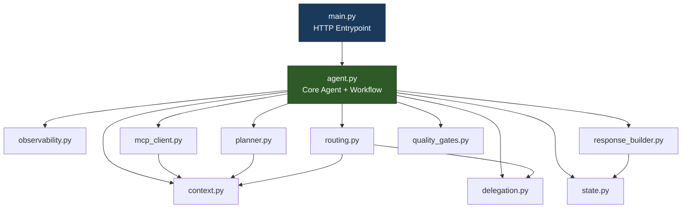

# MATS Orchestrator — Code Refactoring Guideline

**Scope:** [agent.py](file:///Users/robinkv/dev_workplace/all_codebase/auth_micro_agents/finopti-platform/mats-agents/mats-orchestrator/agent.py) (976 lines → target ~300 lines)  
**Aligned with:** [AI_AGENT_DEVELOPMENT_GUIDE.md](file:///Users/robinkv/dev_workplace/all_codebase/auth_micro_agents/finopti-platform/AI_AGENT_DEVELOPMENT_GUIDE.md) v5.0

---

## 1. Current Structure & Problems

`agent.py` currently holds **6 distinct responsibilities** in a single file:

| Lines | Responsibility | Size | Problem |
|-------|---------------|------|---------|
| 1–92 | Imports, Observability, Auth | ~90 | Module-level side effects mixed with config |
| 94–124 | ContextVars + `_report_progress` | ~30 | Duplicated across 13 agents |
| 127–235 | `SequentialThinkingClient` MCP | ~108 | Full class unrelated to agent logic |
| 239–369 | `generate_plan()` LLM tool | ~130 | Self-contained planning module with model fallback |
| 383–443 | `create_app()` factory | ~60 | ✅ Core — **stays** |
| 447–965 | `run_investigation_async()` | ~518 | Monolith with 3 duplicated response blocks |

> **⚠️ WARNING:** The `run_investigation_async` function alone is **518 lines**. It contains inline
> operational routing (~70 lines), SRE resume logic (~50 lines), and the same
> response-formatting block copy-pasted **3 times** (~50 lines each).

---

## 2. Module Decomposition Map

Extract to these new/existing files. Each module is independently testable.

```
mats-orchestrator/
├── agent.py              # CORE: Agent def, App factory, run_investigation_async (slim)
├── main.py               # Entrypoint (unchanged)
│
├── observability.py      # [NEW] Phoenix setup, tracer, instrumentor
├── context.py            # [NEW] ContextVars, _report_progress helper
├── mcp_client.py         # [NEW] SequentialThinkingClient class
├── planner.py            # [NEW] generate_plan(), load_agent_registry()
├── routing.py            # [NEW] Operational routing patterns + handler
├── response_builder.py   # [NEW] format_investigation_response() 
│
├── delegation.py         # (existing — no changes needed)
├── quality_gates.py      # (existing — no changes needed)
├── state.py              # (existing — no changes needed)
├── workflow.py           # (existing — no changes needed)
├── job_manager.py        # (existing — no changes needed)
├── ...
```

---

## 3. Extraction Rules

### Rule A: `agent.py` Retains Only Core Capabilities

After refactoring, `agent.py` should contain **only**:

1. **Imports** from new modules
2. **`create_app()`** — Agent definition + App factory (Rule 8)
3. **`run_investigation_async()`** — High-level workflow orchestration
4. **`run_investigation()`** — Sync wrapper

Everything else is imported.

### Rule B: No Business Logic in Module-Level Code

Module-level code (runs at import time) should be limited to:
- `import` statements
- Logger initialization
- **One** call to `setup_observability()` (from `observability.py`)

### Rule C: Duplicate Code → Shared Helpers

Any block that appears ≥2 times must be extracted into a helper function. Apply to:
- Response message formatting (appears 3×)
- API key / Vertex AI auth guard (appears 2×)
- Confidence score extraction with None-guard (appears 4×)

---

## 4. Detailed Extraction Specs

### 4.1 `observability.py`
**Extract from:** Lines 26–80  
**Exports:** `tracer`, `tracer_provider`, `setup_observability()`

```python
# What goes here:
# - Phoenix register() call
# - SimpleSpanProcessor setup  
# - GoogleADKInstrumentor
# - Startup trace span
# - tracer = trace.get_tracer(__name__)
```

> **💡 TIP:** Wrapping the setup in a `setup_observability()` function prevents side effects
> at import time and makes testing easier.

---

### 4.2 `context.py`
**Extract from:** Lines 94–124  
**Exports:** `_session_id_ctx`, `_user_email_ctx`, `_redis_publisher_ctx`, `_sequential_thinking_ctx`, `_report_progress()`

```python
# What goes here:
# - All ContextVar declarations
# - _report_progress() helper function
# - Any context-initialization helpers
```

> **ℹ️ NOTE:** This module has **zero dependencies** on agent logic. It can be imported by
> `agent.py`, `delegation.py`, `routing.py`, and any future modules.

---

### 4.3 `mcp_client.py`
**Extract from:** Lines 127–235  
**Exports:** `SequentialThinkingClient`, `ensure_sequential_thinking()`

```python
# What goes here:
# - SequentialThinkingClient class (connect, handshake, call_tool, close)
# - ensure_sequential_thinking() context accessor
# - _sequential_thinking_ctx ContextVar (or import from context.py)
```

---

### 4.4 `planner.py`
**Extract from:** Lines 239–379  
**Exports:** `generate_plan()`, `load_agent_registry()`

```python
# What goes here:
# - generate_plan() with full model-fallback logic
# - load_agent_registry() JSON loader
# - Plan validation/normalization (list wrapping logic)
# - Fallback plan construction
```

---

### 4.5 `routing.py`
**Extract from:** Lines 511–584  
**Exports:** `match_operational_route()`, `handle_operational_request()`

```python
# What goes here:
# - operational_routes list (regex patterns → agent URLs)
# - match_operational_route(request_text) → (matched, url, name)
# - handle_operational_request() → Dict result
```

This removes ~70 lines of inline regex matching from `run_investigation_async`.

---

### 4.6 `response_builder.py`
**Extract from:** Lines 765–784, 828–848, 900–951 (3 near-identical blocks)  
**Exports:** `format_investigation_response()`

```python
# What goes here:
# - format_investigation_response(session, arch_result, sre_result) → Dict
# - extract_executive_summary(rca_content) → str
# - safe_confidence(value) → float  (the None-guard pattern)
```

> **🔴 IMPORTANT:** This is the highest-impact extraction. The same ~50-line block for building
> `response_msg` and the return dict is currently **copy-pasted 3 times**.
> A single function eliminates ~100 lines and removes a maintenance hazard.

---

## 5. Target `agent.py` Structure

After refactoring, `agent.py` should look approximately like this:

```python
"""
MATS Orchestrator - Core Agent
"""
# --- Imports ---
from observability import tracer, setup_observability
from context import (
    _session_id_ctx, _user_email_ctx, _redis_publisher_ctx,
    _report_progress
)
from mcp_client import SequentialThinkingClient, _sequential_thinking_ctx
from planner import generate_plan, load_agent_registry
from routing import match_operational_route, handle_operational_request
from response_builder import format_investigation_response, safe_confidence
from delegation import delegate_to_sre, delegate_to_investigator, delegate_to_architect
from quality_gates import gate_planning_to_triage, gate_triage_to_analysis, ...

# --- Setup ---
setup_observability()

# --- Agent + App Factory (CORE) ---
def create_app():
    ...  # ~60 lines — unchanged

# --- Workflow Orchestration (CORE) ---
@trace_span("investigation_run", kind="CHAIN")
async def run_investigation_async(...):
    ...  # ~200 lines (down from 518)

def run_investigation(...):
    ...  # Sync wrapper
```

---

## 6. Dependency Graph



---

## 7. Execution Order

Refactor in this order to minimize risk (each step is independently deployable):

| Step | Module | Risk | Lines Removed from `agent.py` |
|------|--------|------|-------------------------------|
| 1 | `response_builder.py` | Low | ~150 (3 duplicate blocks) |
| 2 | `routing.py` | Low | ~70 |
| 3 | `planner.py` | Low | ~140 |
| 4 | `mcp_client.py` | Low | ~110 |
| 5 | `context.py` | Low | ~30 |
| 6 | `observability.py` | Medium | ~70 |
| **Total** | | | **~570 lines** |

> **⛔ CAUTION:** Step 6 (`observability.py`) changes module-level initialization order.
> Test Phoenix trace emission immediately after this step.

---

## 8. What NOT to Refactor

| Item | Why it stays in `agent.py` |
|------|--------------------------|
| `create_app()` | Core factory — defines the Agent + App. Rule 8 compliance. |
| `run_investigation_async()` | Core workflow — this IS the orchestrator's brain. |
| `run_investigation()` | Sync wrapper, 3 lines. |
| Agent instruction string | Part of the Agent definition inside `create_app()`. |

---

## 9. Verification Checklist

After each extraction step:

- [ ] `python -c "from agent import create_app, run_investigation_async"` succeeds
- [ ] `python verify_agent.py` passes
- [ ] Phoenix traces still appear in dashboard
- [ ] Redis events still stream to UI
- [ ] No circular imports (`python -c "import observability; import context; import mcp_client; import planner; import routing; import response_builder"`)
