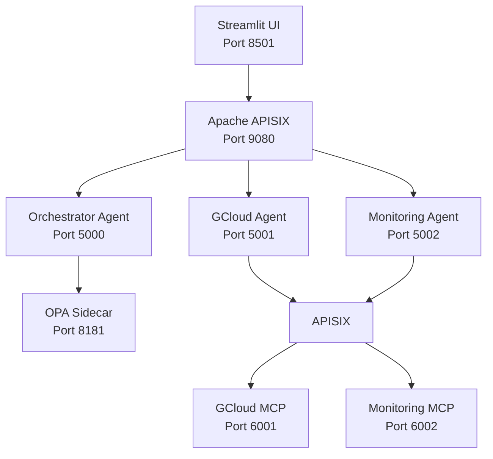

# FinOptiAgents Platform - Implementation Plan

A complete Docker Compose-based FinOps Agentic Platform with Hub-and-Spoke architecture using Apache APISIX, OPA for RBAC, Orchestrator Agent, and specialized Sub-Agents.

## Architecture Overview



## Request Flow

### User Request Flow
1. **User** logs in via Streamlit UI (simulates Google Auth)
2. **UI** sends request to `http://apisix:9080/orchestrator/ask` with `X-User-Email` header
3. **APISIX** routes to Orchestrator Agent
4. **Orchestrator** parses intent and determines target agent
5. **Orchestrator** calls **OPA** at `http://opa:8181/v1/data/finopti/authz` to validate access
6. **OPA** checks RBAC policy:
   - Input: `{"user_email": "admin@cloudroaster.com", "target_agent": "gcloud"}`
   - Output: `{"allow": true/false, "reason": "..."}`
7. If **Allowed**: Orchestrator forwards to `http://apisix:9080/agent/<target>`
8. **Sub-Agent** receives request and calls MCP server via `http://apisix:9080/mcp/<type>`
9. **MCP Server** executes tool and returns result
10. Response flows back through the chain to UI

### User-Agent Permissions (Mock Data)
- `admin@cloudroaster.com` → Role: `gcloud_admin` → Access: GCloud Agent
- `monitoring@cloudroaster.com` → Role: `observability_admin` → Access: Monitoring Agent
- `robin@cloudroaster.com` → Role: `developer` → Access: None (for testing denials)

## Proposed Changes

### Directory Structure

```
/finopti-platform
  /apisix_conf
    - config.yaml           # APISIX configuration
    - init_routes.sh        # Route initialization script
  /opa_policy
    - authz.rego            # Authorization policy
  /orchestrator
    - main.py               # Flask orchestrator service
    - requirements.txt
    - Dockerfile
  /sub_agents
    /gcloud_agent
      - main.py             # GCloud agent service
      - requirements.txt
      - Dockerfile
    /monitoring_agent
      - main.py             # Monitoring agent service
      - requirements.txt
      - Dockerfile
  /mcp_servers
    /gcloud_mcp
      - server.py           # Mock GCloud MCP server
      - requirements.txt
      - Dockerfile
    /monitoring_mcp
      - server.py           # Mock Monitoring MCP server
      - requirements.txt
      - Dockerfile
  /ui
    - app.py                # Streamlit application
    - requirements.txt
    - Dockerfile
  docker-compose.yml        # Main orchestration file
  README.md                 # Setup and usage instructions
```

### Component Details

#### 1. OPA Policy (`opa_policy/authz.rego`)
Implements RBAC logic:
- Maps user emails to roles
- Maps roles to allowed agents
- Returns `allow` boolean and `reason` string

#### 2. Orchestrator Agent (`orchestrator/main.py`)
- **Framework**: Flask (lightweight, simple for prototype)
- **Endpoint**: `POST /ask`
- **Logic**:
  - Extract `X-User-Email` header
  - Parse user prompt for intent detection (keyword-based)
  - Query OPA for authorization
  - Forward to appropriate sub-agent via APISIX
  - Return response or 403 error

#### 3. Sub-Agents
- **GCloud Agent** (`sub_agents/gcloud_agent/main.py`)
  - Endpoint: `POST /execute`
  - Calls `http://apisix:9080/mcp/gcloud` for tool execution
- **Monitoring Agent** (`sub_agents/monitoring_agent/main.py`)
  - Endpoint: `POST /execute`
  - Calls `http://apisix:9080/mcp/monitoring` for tool execution

#### 4. MCP Servers (Mock)
- **GCloud MCP** (`mcp_servers/gcloud_mcp/server.py`)
  - Simple JSON-RPC server
  - Returns mock responses like `{"result": "VM Instance Created"}`
- **Monitoring MCP** (`mcp_servers/monitoring_mcp/server.py`)
  - Simple JSON-RPC server
  - Returns mock responses like `{"result": "CPU Usage is 45%"}`

#### 5. Apache APISIX (`apisix_conf/`)
- **config.yaml**: Basic APISIX configuration
- **init_routes.sh**: Shell script to register routes via Admin API
  - Routes:
    - `/orchestrator/*` → `orchestrator:5000`
    - `/agent/gcloud/*` → `gcloud_agent:5001`
    - `/agent/monitoring/*` → `monitoring_agent:5002`
    - `/mcp/gcloud/*` → `gcloud_mcp:6001`
    - `/mcp/monitoring/*` → `monitoring_mcp:6002`

#### 6. Streamlit UI (`ui/app.py`)
- **Login Sidebar**: Dropdown to select user (simulates Google Auth)
- **Chat Interface**: Text input for prompts
- **Request Handling**: 
  - Sends POST to `http://apisix:9080/orchestrator/ask`
  - Includes `X-User-Email` header
  - Displays response in chat format

#### 7. Docker Compose (`docker-compose.yml`)
Services:
- `etcd`: Key-value store for APISIX
- `apisix`: API Gateway
- `apisix-dashboard`: Web UI for APISIX (optional)
- `opa`: Open Policy Agent
- `orchestrator`: Main orchestration service
- `gcloud_agent`: Sub-agent for GCloud
- `monitoring_agent`: Sub-agent for Monitoring
- `gcloud_mcp`: MCP server for GCloud tools
- `monitoring_mcp`: MCP server for Monitoring tools
- `ui`: Streamlit frontend

Network: `finopti-net` (bridge network)

## Technology Stack

- **API Gateway**: Apache APISIX 3.x
- **Authorization**: Open Policy Agent (OPA)
- **Orchestrator**: Python 3.11 + Flask
- **Sub-Agents**: Python 3.11 + Flask
- **MCP Servers**: Python 3.11 + Flask (JSON-RPC mock)
- **UI**: Streamlit
- **Container Runtime**: Docker Compose

## Verification Plan

### Automated Tests
1. **Start all services**: `docker-compose up -d`
2. **Check service health**:
   ```bash
   docker-compose ps
   curl http://localhost:9080/orchestrator/ask -X POST -H "Content-Type: application/json"
   ```
3. **Test APISIX routes**:
   ```bash
   # Test orchestrator route
   curl -X POST http://localhost:9080/orchestrator/ask \
     -H "X-User-Email: admin@cloudroaster.com" \
     -H "Content-Type: application/json" \
     -d '{"prompt": "create a VM"}'
   
   # Test agent route (should be called by orchestrator)
   curl -X POST http://localhost:9080/agent/gcloud \
     -H "Content-Type: application/json" \
     -d '{"action": "create_vm"}'
   ```
4. **Test OPA policy**:
   ```bash
   curl -X POST http://localhost:8181/v1/data/finopti/authz \
     -H "Content-Type: application/json" \
     -d '{"input": {"user_email": "admin@cloudroaster.com", "target_agent": "gcloud"}}'
   ```

### Manual Verification
1. Open Streamlit UI at `http://localhost:8501`
2. **Test Scenario 1**: Admin accessing GCloud
   - Login as: `admin@cloudroaster.com`
   - Prompt: "create a VM instance"
   - Expected: Success response from GCloud MCP
3. **Test Scenario 2**: Monitoring user accessing Monitoring
   - Login as: `monitoring@cloudroaster.com`
   - Prompt: "check CPU usage"
   - Expected: Success response from Monitoring MCP
4. **Test Scenario 3**: Unauthorized access
   - Login as: `monitoring@cloudroaster.com`
   - Prompt: "create a VM instance"
   - Expected: 403 error (not authorized)
5. **Test Scenario 4**: Developer with no access
   - Login as: `robin@cloudroaster.com`
   - Prompt: "create a VM instance"
   - Expected: 403 error (not authorized)

### Success Criteria
- ✅ All Docker services start successfully
- ✅ APISIX routes configured and accessible
- ✅ OPA policy correctly enforces RBAC
- ✅ Orchestrator correctly routes requests based on intent
- ✅ Sub-agents can communicate with MCP servers via APISIX
- ✅ Streamlit UI displays responses correctly
- ✅ Authorization denials return proper 403 errors

## Notes

> [!IMPORTANT]
> This is a **local development prototype**. For production:
> - Replace mock Google Auth with real OAuth2 flow
> - Implement actual MCP servers with real GCloud and Monitoring tools
> - Add TLS/SSL certificates for APISIX
> - Implement proper secret management
> - Add comprehensive logging and monitoring
> - Implement rate limiting and request validation
> - Add health checks and readiness probes

> [!NOTE]
> The user mentioned they can copy agentic code from another project for GCloud and Monitoring agents. This implementation provides a scaffold that can be easily replaced with the actual agent implementations.
